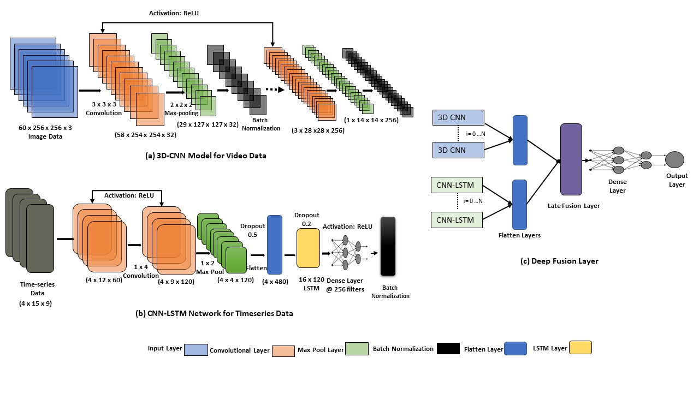

# Cybersickness Prediction from Integrated HMD's Sensors: A Multimodal Deep Fusion Approach using Eye-tracking and Head-tracking Data
_Authors: Rifatul Islam, Kevin Desai and John Quarles._

The University of Texas at San Antonio 

_To appear at the IEEE International Symposium on Mixed and Augmented Reality (ISMAR) 2021 Conference Track._

**Abstract:** 

Cybersickness prediction is one of the significant research challenges for real-time cybersickness reduction. Researchers have proposed different approaches for predicting cybersickness from bio-physiological data (e.g., heart rate, breathing rate, electroencephalogram). However, collecting bio-physiological data often requires external sensors, limiting locomotion and 3D-object manipulation during the virtual reality (VR) experience. Limited research has been done to predict cybersickness from the data readily available from the integrated sensors in head-mounted displays (HMDs) (e.g., head-tracking, eye-tracking, motion features), allowing free locomotion and 3D-object manipulation. This research proposes a novel deep fusion network to predict cybersickness severity from heterogeneous data readily available from the integrated HMD sensors. We extracted 1755 stereoscopic videos, eye-tracking, and head-tracking data along with the corresponding self-reported cybersickness severity collected from 30 participants during their VR gameplay. We applied several deep fusion approaches with the heterogeneous data collected from the participants. Our results suggest that cybersickness can be predicted with an accuracy of 87.77\%  and a  root-mean-square error of 0.51 when using only eye-tracking and head-tracking data. We concluded that eye-tracking and head-tracking data are well suited for a standalone cybersickness prediction framework. 

**Architechture:**

